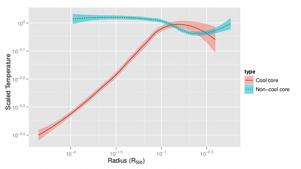
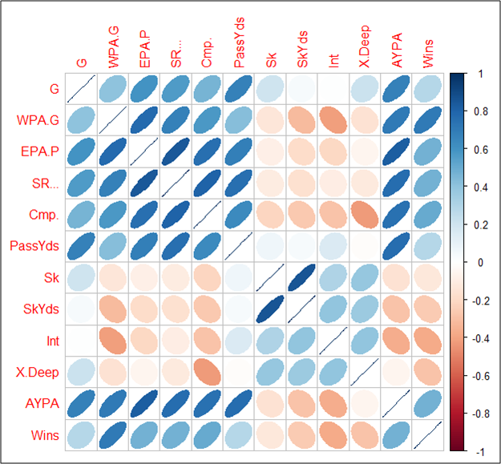
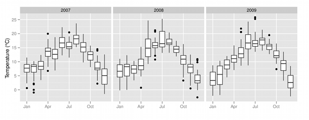
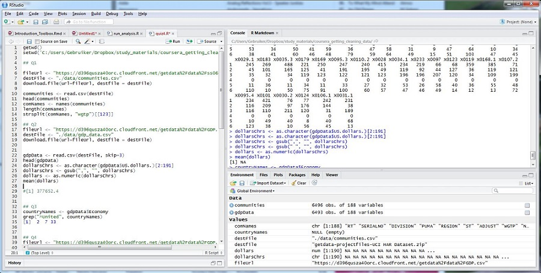

```{r setup, cache = F, echo = F, message = F, warning = F, tidy = F}
source("rmarkdown_knitr_header.R")
```

# Why do statistical programming?

## Complete reproducibility and flexibility

- Keeping an exact log of all your mouse clicks in Excel may be problematic...
- Redoing an analysis with adjustments is easy
- Store the analysis, not its output

# The R toolbox

## Overview

This presentation will introduce you to a toolbox that will serve you well during your data quests.  

- The R programming language
- The R studio IDE (Integrated Development Environment)
- R Markdown as documenting and reporting tool
- swirl as training environment


## Tool 1: R itself


## The R programming language

Wikipedia says:  
    "R is a programming language and software environment for statistical 
    computing and graphics. The R language is widely used among 
    statisticians and data miners for developing statistical software
    and data analysis"


## R is just a programming language

- R is a programming language like any other. 
- It knows about character data, numbers, lists, functions (...but **has no dicts**)
- Like Python, it has an interactive mode


## R is **not** just a programming language

- It has embedded advanced graphical support
- It has extensive support for statistical work

## R showcase (1)



## R showcase (2)



## R showcase (3)


## R showcase (4)



## What is funny about R

In R, **EVERYTHING** lives inside a vector. There are no singular variables of atomic data types, only vectors of length zero or greater:

```{r all_is_vector}
x <- 42
x
x[1]
x[1][1][1][1]
```


## Tool 2: RStudio


## RStudio is the IDE for R




## Tool 3: RMarkdown


## RMarkdown is a great reporting tool

You can use it  

- to create reports in word, pdf or html
- you can use it to create presentations (such as this one)
- support for it is integrated in RStudio
- to embed R code that will be executed to generate your report


## RMarkdown is really basic


[source http://rmarkdown.rstudio.com/](http://rmarkdown.rstudio.com/)

## Tool 4: swirl


## swirl 

- Swirl is a very nice tool to train your R brain  
- It is a framework for interactive lessons in R 
- I recommend doing those!
- See [swirlstats.com](http://swirlstats.com/)


## Let's get dirty

- OK, before we're going into the gritty details of R, let me try to convince you why it could be nice to learn it.
- R has a very nice `package` of demo datasets
- `ChickWeight` is one of these - a dataframe with 578 weight measurements of chicks on different diets

```{r demo_chickweight_part1}
head(ChickWeight)
```

## Plotting ChickWeight
- I want to explore weight trends over time for the different diets
- Done using the ggplot2 package in only a few lines of code
- *I challenge you to try this in Excel!!*

```{r demo_chickweight_part2, fig.keep = "none"}
library(ggplot2)
#make nicer labels
ChickWeight$Diet <- factor(ChickWeight$Diet,
        labels = c("Diet 1", "Diet 2", "Diet 3", "Diet 4"))
ggplot(ChickWeight, aes(x = Time, y = weight)) + facet_grid(. ~ Diet) +
    geom_point(aes(color = Chick), alpha = 0.3, size = 1) + 
    geom_line(aes(color = Chick), alpha = 0.3) + 
    geom_smooth(method = "loess", size = 1) +
    theme(legend.position="none") +
    xlab("Time (days)") + ylab("Weight (grams)")
```

* picture on next slide

----

```{r demo_chickweight_part3, echo = FALSE}
library(ggplot2)
#make nicer labels
ChickWeight$Diet <- factor(ChickWeight$Diet,
        labels = c("Diet 1", "Diet 2", "Diet 3", "Diet 4"))
ggplot(ChickWeight, aes(x = Time, y = weight)) + facet_grid(. ~ Diet) +
    geom_point(aes(color = Chick), alpha = 0.4, size = 1) + 
    geom_line(aes(color = Chick), alpha = 0.4) + 
    geom_smooth(method = "loess", size = 1) +
    theme(legend.position="none") +
    xlab("Time (days)") + ylab("Weight (grams)")
```

## The end

- This concludes the overview of the toolbox and demo use case
- In the next presentation we'll cover some basic R and then come back to visit R markdown

