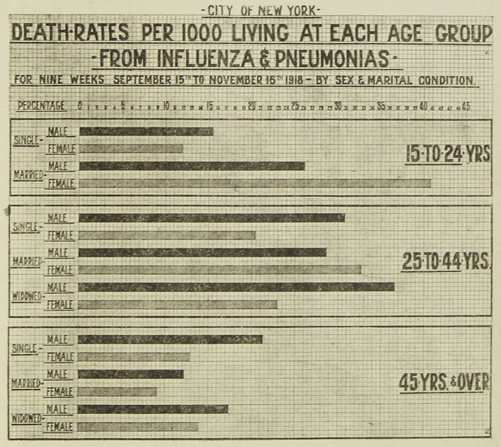
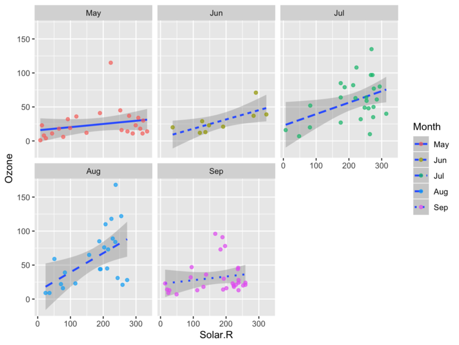

```{r setup, cache = F, echo = F, message = F, warning = F, tidy = F}
source("rmarkdown_knitr_header.R")
```

## Embarking in Data Science




# Why do statistical programming?

## Complete reproducibility and flexibility

- Keeping an exact log of all your mouse clicks in Excel may be problematic...
- Redoing an analysis with adjustments is easy
- Store the analysis, not its output

# The R toolbox

## Overview

This presentation will introduce you to a toolbox that will serve you well during your data quests.  

- The R programming language
- The R studio IDE (Integrated Development Environment)
- R Markdown as documenting and reporting tool
- swirl as training environment


## Tool 1: R itself


## The R programming language


Besides its free nature, R is very popular because it  

- has an interactive mode (read–evaluate–print loop: REPL)
- makes repeating analyses (with new data) very easy
- supports "literate programming" for creating presentations (such as this one!) and reports
- has embedded advanced graphical support


## R graphics showcase

Below follow some figures that you will be able to make at the end of this smester



-----


-----


## Tool 2: RStudio


## The workbench


## Tool 3: RMarkdown


## RMarkdown is a great reporting tool

In RMarkdown, you can combine regular text and figures with embedded R code that will be executed to generate a final document.

You can use it to  

- create reports in word, pdf or html (web)
- create presentations (such as this one)
- create entire websites (as the next course shows)


## RMarkdown is really basic


[source http://rmarkdown.rstudio.com/](http://rmarkdown.rstudio.com/)

## Tool 4: swirl


## swirl 

- Swirl is a very nice tool to train your R brain  
- It is a framework for interactive lessons in R 
- I recommend doing those!
- See [swirlstats.com](http://swirlstats.com/)


