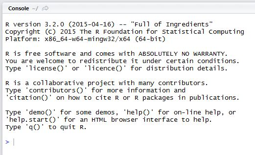

```{r setup, cache = F, echo = F, message = F, warning = F, tidy = F}
source("rmarkdown_knitr_header.R")
```

```{r echo = F}
par(mar=c(4, 4, 1.5, 0))
```

## R basics

**Contents**

- The console
- Variables: vectors 
- Data types
- Plotting (first iteration)
- Getting help
- cCoding rules


# Part 1: The R console


## The console awaits your commands



## The console

- The console is one of your RStudio panels
- The prompt is the "greater than" symbol ">"
- The cursur waits there for your commands
- You can simply use it as a calculator

```{r as_calculator, prompt=TRUE}
2 + 4
21 / 3
```

# Part 2: First steps

## R is all about vectors

- Repeat after me: **"everything in R lives inside vectors"**
- When you type '2 + 4', R wil do this:  

    - create a vector of length 1 with the value 2
    - create a vector of length 1 with the value 4
    - add the value of the second vector to ALL the values of vector one, and recycle vector 2 as many times as needed  
  
- We'll revisit this behavior later, after the basics of vector creation and conversion


## Creating vectors

- The simplest way (there are many) to create a vector is to use the "Concatenate" function c()
- c() takes all its arguments and puts them behind each other in a vector

```{r simple_vectors, prompt=TRUE}
c(2, 4, 3)
c("a", "b", c("c", "d"))
c(0.1, 0.01, 0.001)
```


## Vectors can hold only one data type

- A vector can hold only one type of data
- R tries very hard to **coerce** all data to one type

```{r all_is_vector}
c(2, 4, "a")
```


## Ask for her type

```{r data_types}
class(c(2, 4, "a"))
class(1:5)
class(c(2, 4, 0.3))
```


## Ask for help

- Learning a language is also learning to find how to do things  

    1. Use the help function `help("c")` or `?<function>`
    2. Google it "R function to concatenate vectors", "R package to read xml data"
    3. Use an expert site like Stackoverflow

## Comments
- Everything on a line after a hash sign "#" will be ignored by R

```{r comments}
## starting cool analysis
x <- c(T, F, T) # Creating a logical vector
y <- c(TRUE, FALSE, TRUE) # same
```


## Assigning values

- The arrow symbol "<-" is used to assign values to variables
- You can also use "=" but you should do this only with function arguments

```{r assignment}
x <- c(1, 2, 3) # recommended
x
y = c(2, 3, 1) # legal but not recommended
y
```

## Ending statements

- You can optionally end statements with a semicolon ";"
- Only when you have more statements on one line they are mandatory
- *Rule*: Have one statement per line and don't use semicolons

```{r semicolon}
x <- c(1, 2, 3); x; x <- 42; x
```


# Part 3: Vector fiddling


## Vector arithmetic (1)

- Going back to the vector arithmetic
- Let's just look at some examples

```{r vector_arithmetic1}
x <- c(2, 4, 3, 5)
y <- c(6, 2)
x + y
x * 2
```


## Vector arithmetic (2)

```{r vector_arithmetic2, warning=TRUE}
x <- c(2, 4, 3, 5)
z <- c(1, 2, 3)
x - z
```

- As you see, this also generates a warning that "longer object length is not a multiple of shorter object length"
- But R will proceed anyway, by recycling the shorter one!

## The R basic data types

- These are the types all others are built from  

| class     | type                   |
|-----------|------------------------|
| integer   | whole numbers          |
| numeric   | floating point numbers |
| character | textual data           |
| factor    | categorial data        |
| logical   | TRUE or FALSE          |


## Creating vectors of specific type

- Often you want to be specific about what you create
- Use the class specific constructor **OR** the conversion methods
- constructor methods have the name of the type
- conversion methods have "as." prepended to the name


## Method 1: Constructor functions

```{r creating_types}
integer(4)
character(4)
logical(4)
factor(4)
```


## Method 2: Conversion functions

Conversion methods have the name `as.XXX()` where XXX is the desired type

```{r converting_types}
x <- c(1, 0, 2, 0, 2)
class(x)
as.logical(x)
as.factor(x)
```


## Even R will stop trying at some point

- R will not coerce types that are non-coercable: you get an NA

```{r coercion, warning=TRUE}
x <- c(2, 3, "a")
y <- as.integer(x)
class(y)
y
```


## Method 3: Using colon to create a series

The colon *(`:`)* operator generates a series of integers

```{r colon_vector}
1 : 5
5 : 1
2 : 3.66
```


## Method 4: Using the `rep()` function

```{r rep_vector}
rep(1 : 3, times = 3)
rep(1 : 3, each= 3)
rep(1 : 3, times = 2, each = 3)
```


## Method 5: Using the `seq()` function

```{r seq_vector}
seq(from = 1, to = 3, by = .2)
seq(1, 2, 0.2) # same
seq(1, 0, length.out = 5)
seq(3, 0, by = -1)
```


## Method 6: through vector operations

```{r derived_vector}
x <- rnorm(5); x
y <- rnorm(5); y
z <- x < y ## which of x are smaller than corresponding index in y
z ## you get a logical vector
```


# Part 4: Advanced vector fiddling


## Operators and vectors in practice

Suppose you have vectors a and b and you want to know which values in a are greater than in b and also smaller than 3

```{r operator_example}
a <- c(2, 1, 3, 1, 5, 1)
b <- c(1, 2, 4, 2, 3, 0)
a > b & a < 3 ## returns a logical vector with test results
6 - 2 : 5 ## think about this one!
```

## Subsetting vectors

Often, you want to get to know things about values in a vector  

- what is the highest value?
- which positions have negative values?
- what are the last 5 values?

There are several ways to do this 

- by index
- by boolean test / logical vector
- using `which()`

## Subsetting vectors by index

- The index is the position of a value in a vector
- R starts at 1 (unlike most other languages)

```{r indexing_1}
x <- rep(c(1, 2, 3), 2); x
x[4] ## fourth element
x[3:5] ## elements 3 to 5
```

## Subsetting vectors by index (cont.)

```{r indexing_2}
x <- c(1, 2, 3, 1, 2, 3)
x[c(1, 2, 5)] ## elements 1, 2 and 5
x[c(T, T, F, F, T, T)] ## select using booleans
x[x %% 2 == 0] ## all even elements using modulus
```


## Subsetting vectors by index (cont.)

```{r indexing_3}
x <- c(1, 2, 3, 1, 2, 3)
x[(length(x) - 1) : length(x)] ## last 2 elements; note the parentheses!!!
which(x >= 2) ## ask for the positions
which(x == max(x)) ## which positions have the maximum value
x[x == max(x)]
```


## Calculations with logical vectors

- Often, you want to know how many cases fit some condition
- Logical values have a numeric counterpart: 
    - TRUE == 1
    - FALSE == 0
- Use `sum()` to use this feature
    
```{r logical_math}
x <- c(2, 4, 2, 1, 5, 3, 6)
x > 3 ## which values are greater than 3 -- logical vector
sum(x > 3) ## returns number of values greater than 3
```


# Part 5: Plotting vectors


## Basic plot types

- Looking at numbers is boring - people want to see pictures!
- There are a few basic plot types dealing with (combinations of) vectors: 
    - scatter (or line-) plot
    - barplot
    - histogram
    - boxplot

## Scatter and line plots

- Meet `plot()` - the workhorse of R plotting


```{r plot_hello_1, fig.height = 4, fig.width = 6}
time <- c(1, 2, 3, 4, 5, 6)
response <- c(0.09, 0.30, 0.41, 0.48, 0.72, 1.12)
plot(x = time, y = response)
```


## Plot decoration

- By passing arguments to `plot()` you can modify or add many features of your plot
- Basic decoration includes 
    - adjusting markers (`pch = 19`, `col = "blue"`)
    - adding connector lines (`type = "b"`)
    - adding axis labels and title (`xlab = "Time (hours)"`, `ylab = "Systemic response"`, `main = "Systemic response to agent X"`)
    - adjusting axis limits (`xlim = c(0, 8)`)


## Plot decoration

```{r, fig.width = 6, fig.height = 4}
plot(x = time, y = response, pch = 19, type = "b", xlim = c(0, 8),
     xlab = "Time (hours)", ylab = "Systemic response",
     main = "Systemic response to agent X", col = "blue")
```


## Barplots

- Barplots can be generated in two ways
    - By passing a factor to plot() - simple of level frequencies
    - By using barplot()

```{r plot_hello_3, fig.height = 3.5, fig.width = 4.5}
persons <- as.factor(sample(c("male", "female"), size = 100, replace = T))
plot(persons)
```


## `barplot()`

- `barplot()` can be called with a vector of heights (frequencies) or a table() object

```{r barplot_1, fig.height = 4, fig.width = 6}
frequencies <- c(22, 54, 12, 29)
barplot(frequencies, names = c("one", "two", "three", "four"))
```


## `barplot()` with a table object

```{r barplot_2, fig.height = 3, fig.width = 4.5}
table(persons)
barplot(table(persons))
```


## Histograms

Histograms help you visualise the distribution of your data

```{r histogram_1, fig.height = 3.5, fig.width = 5}
male_weights <- c(rnorm(500, 80, 8)) ## create 500 random numbers around 80
hist(male_weights)
```


## Histograms (2)

Using the `breaks` argument, you can adjust the bin width. Always explore this option when creating histograms!

```{r histogram_2, fig.height = 3, fig.width = 8}
par(mfrow = c(1, 2)) # make 2 plots to sit side by side
hist(male_weights, breaks = 5, col = "gold", main = "Male weights")
hist(male_weights, breaks = 25, col = "green", main = "Male weights")
```


## Boxplots

This is the last of the basic plot types. A boxplot is a visual representation of the *5-number summary* of a variable.  

```{r boxplots_1, fig.height = 3, fig.width = 7}
persons <- rep(c("male", "female"), each = 100)
weights <- c(rnorm(100, 80, 6), rnorm(100, 75, 8))
#print 6-number summary (5-number + mean)
summary(weights[persons == "female"])
```


## Boxplots (2)

```{r boxplots_2, fig.height = 4, fig.width = 7, results = "hold"}
par(mfrow = c(1, 2)) # make 2 plots to sit side by side
# create boxplots of weights depending on sex
boxplot(weights ~ persons, ylab = "weight")
boxplot(weights ~ persons, notch = TRUE, col = c("yellow", "magenta"))
```


# Part 6: Some ground rules

## Plotting rules

Plots should always have these decorations 

- A descriptive title
- Axis labels indicating measurement type and its units
- If multiple data series are plotted: a legend

*For the sake of space saving, I will not always adhere to these rules in my presentations*


## Coding style rules (1)

- Follow Googles' [https://google-styleguide.googlecode.com/svn/trunk/Rguide.xml](https://google-styleguide.googlecode.com/svn/trunk/Rguide.xml)
- Names of variables start with a lower-case letter
- Words are separated using dots (or use camel case)
- Be descriptive with names
- Function names are verbs
- Write all code and comments in English
- Always use extensive comment in your code
- Preferentially use one statement per line


## Coding style rules (2)

- Use spaces on both sides of ALL operators
- Use a space after a comma
- Indent code blocks -with {}- with 4 spaces

```{r coding_style}
rnorm(5,mean=3) #bad
rnorm(5, mean = 3) #good
```

## Source file template
```
# Name & Email address
# File description comment
# including purpose of program,
# inputs, and outputs

#### source() & library() statements ####

#### Function definitions ####

#### Excecuted code ####
```

## Operators

-  Math: `+  -   *   /   ^`
-  Logic:  
`& 		# and  
| 		# or  
! 	# not`  
-  Comparison: 
`<   <=   >   >=    ==`

## Operator precedence (1)

Some operators are evaluated before others. This is called operator precedence and it is best illustrated by an example

```{r precedence_1}
1 + 2 / 3
(1 + 2) / 3
2 - 2 * 5 - 5
```

## Operator precedence (2)

- When you have complex statements, you should be aware of operator precedence
- If you are not sure: use parentheses `()`
- If you are still uncertain, look at [this reference page](https://stat.ethz.ch/R-manual/R-devel/library/base/html/Syntax.html)


## Wrap-up of the basics

- help on function: `help(function)`
- or `?function`
- autocomplete/suggestions in RStudio: `tab` key
- help (in Rstudio): F1
- installing a library that is not in the core packages: `install.packages("ggplot2"")`
- loading a library that is not in the core packages: `library(ggplot2)`
- remove variable(s): `rm(x, y, z, myData)`


