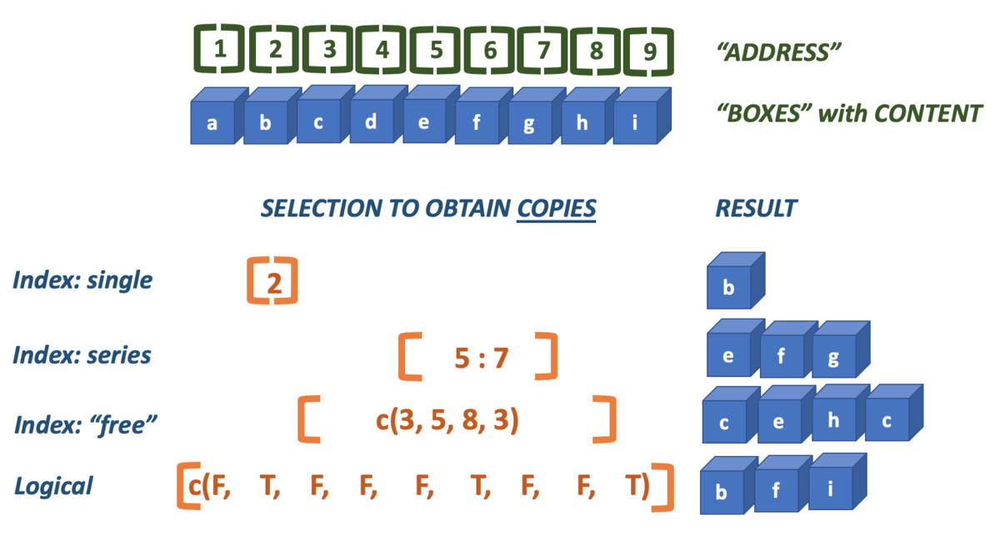

    
```{r setup, cache = F, echo = F, message = F, warning = F, tidy = F}
source("rmarkdown_knitr_header.R")
```

```{r echo = F}
par(mar=c(4, 4, 1.5, 0))
```

## R basics

**Contents**

- The console
- Variables: vectors 
- Data types
- Plotting (first iteration)
- Getting help
- Coding rules

# RStudio


## The workbench


## Panels of the workbench

You work with 4 panels in the workbench:

1. **Code editor** where you write your scripts: text file with code you want to execute more than once
2. **R console** where you execute lines of code one by one
3. **Workspace and history** See what data you have in memory, and what you have done so far
4. **Plots, Help & Files** ...


## The console vs code editor

- Use the console to do basic calculations, try pieces of code, develop a function, or load scripts (from the code editor) into memory.

- Use the code editor to work on stored code - analyses you may want to repeat, or develop further. 

- In the code editor, you can edit data files, programs (scripts), and analytical notebooks (RMarkdown)


# Basic Math


## The console

- The prompt is the "greater than" symbol ">"
- R waits here for you to enter commands
- You can use the console as a calculator
- R supports all math operations in the way you would expect them:

----

`+` &nbsp;&nbsp;&nbsp;&nbsp;is 'plus', as in 2 + 2 = 4  

`-`&nbsp;&nbsp;&nbsp;&nbsp; ditto, subtract, as in 2 - 2 = 0  

`*`&nbsp;&nbsp;&nbsp;&nbsp; multiply  

`/`&nbsp;&nbsp;&nbsp;&nbsp; divide  

`^`&nbsp;&nbsp;&nbsp;&nbsp; exponent (identical to: `**`)

for the square root you can use $n^{0.5}$: `n**0.5`  

use parentheses `()` for grouping parts of equations.

## Operator Precedence

All "operators" adhere to the standard mathematical **precedence** rules (PEMDAS):

```
    Parentheses (simplify inside these)
    Exponents
    Multiplication and Division (from left to right)
    Addition and Subtraction (from left to right)
```

- With complex statements you should be aware of operator precedence!
- If you are not sure: use parentheses `()`
- If you are still uncertain, look at [this reference page](https://stat.ethz.ch/R-manual/R-devel/library/base/html/Syntax.html)


## --Practice 1--

In the console, calculate the following:

$31 + 11$  

$66 - 24$  

$\frac{126}{3}$  

$12^2$   

$\sqrt{256}$  

$\frac{3*(4+\sqrt{8})}{5^3}$


## Solutions

$31 + 11 = 42$  

$66 - 24 = 42$  

$\frac{126}{3} = 42$  

$12^2 = 144$   

$\sqrt{256} = 16$  

$\frac{3 * (4 + \sqrt{8})}{5^3} = 0.1638823$


## An expression dissected

When you type `21 / 3` this called an **_expression_**.  

The expression has three parts: an operator (`/` in the middle) and two operands (left operand `21` and right operand `3`).  

Since there is no assignment, the result will be send to the console as output, giving `[1] 7`.  

Because this expression is the sole contents of the current line in the console, it is also called a **_statement_**.

## Statement vs expression 

__A statement is a complete line of code that performs some action, while an expression is any section of code that evaluates to a value.__


# Functions

## Definition

Simple mathematics is not the core business of R.  

Going further than basic math, you will need functions.  

**_A function is a piece of functionality that you can execute by typing its name, followed by a pair of parentheses. Within these parentheses, you can pass data for the function to work on. Functions often return a value but not always_**

Function usage has this general form:
$$function\_name(argument, argument, ...)$$

## Example: Square root with `sqrt()`

You have already seen that the square root can be calculated as $n^{0.5}$.  

However, there is also a function for it: `sqrt()`. It **_returns_** the square root of the given number, _e.g._ `sqrt(36)` 

```{r sqrt-demo}
36^0.5
sqrt(36)
```

## Another example: `paste()`  

The `paste` function can take any number of arguments and returns them combined into a single text string. You can also specify a separator using `sep="<separator string>"`:


```{r paste-demo}
paste(1, 2, 3, sep = "---")
```

Note the use of quotes surrounding the dashes: `"---"`; they indicate it is text data.  
Note also the use of a name for only the last argument. Not all arguments can be specified by name, but when possible this has preference, as in `sep = "---"`.

## Getting help on a function

Type `?function_name` in the console to get help on a function.  
For instance, typing `?sqrt` will give the help page of the square root function.  

Scroll down in the help to see example usages of the function.

## --Practice 2--

1. View the help page for `paste`. There are two variants of this function.  
    - Which? And what is the difference between them?
    - Use both variants to generate exactly this message `"welcome to R"` from these arguments: `"welcome ", "to ", "R"`
2. What does the `abs` function do?  
    - What is returned by `abs(-20)` and what is `abs(20)`?  
3. What does the `c` function do?  
    - What is the difference in returned value of `c()` when you combine either `1`, `3` and `"a"` as arguments , or `1`, `2` and `3`? 

# Variables

## What are variables?

- In math, you often use variables to label or name pieces of data, or a function.
- E.g., `x = 42` is used to define a variable `x`, with a value of `42`. 
- In programming (and R) this is the same. 
- Variables are really _variable_ - their value can change!
- In R you can assign a value to a variable using "`<-`", so "`x <- 42`" is equivalent to "`x = 42`"


## --Practice 3--

Create three variables with the given values - x=20, y=10 and z=3. Next, calculate the following with these variables:  

1. $x+y$
2. $x^z$
3. $q = x \times y \times z$
4. $\sqrt{q}$
5. $\frac{q}{\pi}$ (pi is simply pi in R)
6. $\log_{10}{(x \times y)}$


# Vectors

## R is vector-based

- In R, _**all data lives inside vectors**_.
- When you type '2 + 4', R will do this:  

    - create a vector of length 1 with its element having the value 2
    - create a vector of length 1 with its element having the value 4
    - add the value of the second vector to ALL the values of vector one, and recycle any shorter vector as many times as needed  
  
- We'll revisit this behavior later.


## Five types of data

R knows five basic types of data:

**numeric**:&nbsp; numbers with a decimal part: `3.123`, `5000.0`, `4.1E3`  
**integer**:&nbsp; numbers without a decimal part: `1`, `0`, `2999`  
**logical**:&nbsp; `true` or `false` (also called Boolean values)   
**character**:&nbsp; text, should be put within quotes: `"hello R"`  
**factor**:&nbsp; nominal and ordinal scales (dealt with later)   

**Note 1:** If you type a number on the console, it will always be a `numeric` value, decimal part or not.  

**Note 2:** For character data, single and double quotes are equivalent but double are preferred.  


## Creating vectors

- The simplest way (there are many) to create a vector is to use the "Concatenate" function `c()`
- `c()` takes all its arguments and puts them behind each other in a vector

```{r simple-vectors, prompt=TRUE}
c(2, 4, 3)
c("a", "b", c("c", "d"))
c(0.1, 0.01, 0.001)
```


## Vectors can hold only one data type

- A vector can hold only one type of data
- R tries very hard to **coerce** all data to one type

```{r all-is-vector}
c(2, 4, "a") ## becomes a character vector
```


## Get the type

Using the function `class()`, you can get the data type of a vector.

```{r data-types-demo, results='hold'}
class(c(2, 4, "a"))
class(1:5)
class(c(2, 4, 0.3))
class(c(2, 4, 3))
```


## Comments

- Everything on a line after a hash sign "#" will be ignored by R

```{r comments}
## starting cool analysis
x <- c(T, F, T) # Creating a logical vector
y <- c(TRUE, FALSE, TRUE) # same
```


## Ending statements

- You can optionally end statements with a semicolon ";"
- Only when you have more statements on one line they are mandatory

```{r semicolon}
x <- c(1, 2, 3); x; x <- 42; x
```

- *Rule*: Have one statement per line and don't use semicolons


# Vector fiddling


## Vector arithmetic

- Going back to the vector arithmetic
- Let's just look at some examples

```{r vector_arithmetic1, results = "hold"}
x <- c(2, 4, 3, 5)
y <- c(6, 2)
x + y
x * 2
```

R works **_set based_** and will **_cycle_** the shorter of the two operands to be able to deal with all elements of the longer operand. 

----

```{r vector_arithmetic2, warning=TRUE}
x <- c(2, 4, 3, 5)
z <- c(1, 2, 3)
x - z
```

- As you see, this generates a warning that "longer object length is not a multiple of shorter object length"
- But R will proceed anyway, by cycling the shorter one!


## Other operators

-  Logical operators:  

    - `&`: logical "AND"  
    - `|`: logical "OR"  
    - `!`: logical "NOT"

-  Comparison operators (also logical):  
    - `<   <=   >   >=    ==`
- Modulo: `%%`
- Integer division: `%/%`
- The `%in%` operator

## Modulo: `%%`

The modulo operator gives the remainder of a division:

```{r modulo-demo}
10 %% 3
4 %% 2
11 %% 3
```

## Integer division `%/%`

The integer division is the complement of modulo and gives the integer part of a division:

```{r integer-division-demo}
10 %/% 3
4 %/% 2
11 %/% 3
```

## The `%in%` operator

The `%in%` operator is very handy when you want to know if the elements of one vector are present in another vector. An example explains best, as usual:

```{r in-test-demo, results='hold'}
a <- c("one", "two", "three")
b <- c("zero", "three", "five", "two")
a %in% b
b %in% a
```

There is no positional evaluation, it simply reports if the corresponding element in the first is present _anywhere_ in the second.


# Vector creation methods

## Creating vectors of specific type

- Often you want to be specific about what you create: use the class-specific constructor **OR** one of the conversion methods
- constructor methods have the name of the type
- conversion methods have "as." prepended to the name


## Method 1: Constructor functions

```{r creating-types}
integer(4)
character(4)
logical(4)
```


## Method 2: Conversion functions

Conversion methods have the name `as.XXX()` where XXX is the desired type

```{r converting-types}
x <- c(1, 0, 2, 2.3)
class(x)
as.logical(x)
as.integer(x)
```


## Limits to coercion

- R will not coerce types that are non-coercable: you get an `NA` value.

```{r coercion, warning=TRUE}
x <- c(2, 3, "a")
y <- as.integer(x)
class(y)
y
```


## Method 3: The colon operator

The colon operator *(`:`)* generates a series of integers

```{r colon-vector}
1 : 5
5 : 1
2 : 3.66
```


## Method 4: The `rep()` function

```{r rep_vector}
rep(1 : 3, times = 3)
rep(1 : 3, each= 3)
rep(1 : 3, times = 2, each = 3)
```


## Method 5: The `seq()` function

```{r seq_vector}
seq(from = 1, to = 3, by = .2)
seq(1, 2, 0.2) # same
seq(1, 0, length.out = 5)
seq(3, 0, by = -1)
```


## Method 6: Through vector operations

This operation of two numeric vectors results in a logical vector:

```{r derived-vector}
1:5 < c(2, 3, 2, 1, 4)
```


# Advanced vector fiddling


## Operators and vectors in practice

Suppose you have vectors a and b and you want to know which values in `a` are greater than in `b` and also smaller than `3`

```{r operator-example}
a <- c(2, 1, 3, 1, 5, 1)
b <- c(1, 2, 4, 2, 3, 0)
a > b & a < 3 ## returns a logical vector with test results
```

Can you figure out this one?
```{r}
6 - 2 : 5
```


## Selecting vector elements

Often, you want to get to know things about values in a vector  

- what value is at the third position?
- what is the highest value?
- which positions have negative values?
- what are the last 5 values?

There are several ways to do this as we'll see

## Indexing explained



## Selecting by index

- The `index` is the position of a value in a vector.
- R starts at one (1)
- Use brackets `[]` to specify one or more selected indices

```{r indexing-1}
x <- c(2, 4, 6, 3, 5, 1)
x[4] ## fourth element
x[3:5] ## elements 3 to 5
```

-----

```{r indexing-2}
x <- c(2, 4, 6, 3, 5, 1)
x[c(1, 2, 2, 5)] ## elements 1, 2, 2 and 5
x[c(F, T, F)] ## select using booleans - cycled
x[x %% 2 == 0] ## all even elements using modulo
```


-----

```{r indexing-3}
x <- c(2, 4, 6, 3, 5, 1)
x[(length(x) - 1) : length(x)] ## last 2 elements; note the parentheses!!
x[length(x) - 1 : length(x)]
x[x == max(x)]
```

## Use `which()` to get an index instead of value

The function `which()` returns indices for which the logical test evaluates to `true`:

```{r}
which(x >= 2) ## which positions have values 2 or greater?
which(x == max(x)) ## which positions have the maximum value?
```


## Calculations with logical vectors

- Often, you want to know how many cases fit some condition
- Logical values have a numeric counterpart: 
    - TRUE == 1
    - FALSE == 0
- Use `sum()` to use this feature
    
```{r logical_math}
x <- c(2, 4, 2, 1, 5, 3, 6)
x > 3 ## which values are greater than 3?
sum(x > 3) ## how many are greater than 3?
```


# Some ground rules

## Coding style rules

- Names of variables start with a lower-case letter
- Words are separated using underscores
- Be descriptive with names
- Function names are verbs
- Write all code and comments in English
- Preferentially use one statement per line
- Use spaces on both sides of ALL operators
- Use a space after a comma
- Indent code blocks -with {}- with 4 or 2 spaces, but be consistent

Follow Hadleys' style guide [http://adv-r.had.co.nz/Style.html](http://adv-r.had.co.nz/Style.html)


## Wrap-up of the basics

- help on function: `help(function)`
- or `?function`
- auto-complete/suggestions in RStudio: `tab` key
- help (in Rstudio): F1
- installing a library that is not in the core packages: `install.packages("ggplot2"")`
- loading a library that is not in the core packages: `library(ggplot2)`
- remove variable(s): `rm(x, y, z, myData)`

## The best keyboard shortcuts

- `ctr + 1` go to code editor
- `ctr + 2` go to console
- `ctr + alt + i` insert code chunk (RMarkdown)
- `ctr + enter` run current line
- `ctr + shift + k` knit current document
- `ctr + alt + c` run current code chunk
- `ctr + shift + o` source the current document

