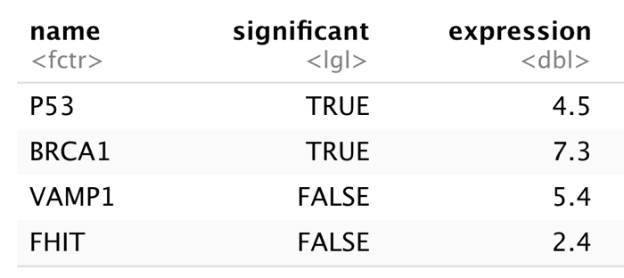

```{r setup, cache = F, echo = F, message = F, warning = F}
#comment this out for pdf output
source("rmarkdown_knitr_header.R")
```

```{r echo = F}
par(mar=c(4, 4, 1.5, 0))
```

## Complex datatypes and IO

**Contents**

- Matrices
- Factors
- Lists
- Data frames
- Reading dataframes from file (first iteration)
- Plotting with dataframes

# Matrices

## Matrices are vectors with dimensions

- A matrix is simply a vector with a dimension attribute
- Here are two ways to create them

```{r matrix_demo1}
m <- matrix(1:10, nrow = 2, ncol = 5); m
v <- 1:10; dim(v) <- c(2, 5); v
```

## Matrix usages

- The matrix is an extremely important datastructure; there is an entire scientific field called "matrix algebra"
- However, we do not really need it yet, except maybe for barplots:

```{r matrix_demo2}
m <- matrix(c(3, 10, 12, 6, 7, 13), nrow = 2, ncol = 3); m
```

----

```{r matrix_demo3}
barplot(m, names = c("one", "two", "three"))
```

## Arrays

- Arays are also vectors with a dimensions (`dim`) attribute
- Also created using `array()` function
- An array with 2 dimensions is a matrix

```{r arrays1}
x <- 1:10
dim(x) <- c(2, 5)
x
class(x)
```


----

```{r arrays2, results='hold'}
a <- array(data = 1:12, dim = c(2, 3, 2)) # same as "a <- 1:12; dim(a) <- c(2,3,2)"
rownames(a) <- c("one", "two")
colnames(a) <- c("a", "b", "c")
a
class(a)
```


# Nominal & Ordinal scales: Factors

## Factors

- Although factors are not actually a complex datatype I saved them because they have some strange behaviour.
- Factors are used to represent different levels of a variable. 
- For instance:  
    - eye color (brown, blue, green)
    - weight class (underweight, normal, obese)
    - autism spectrum (none, sligh, heavy) 


## Nominal or Ordinal?

- Factors are used to represent data in nominal and ordinal scales
- Nominal has no order (e.g. eye color)
- Ordinal has order (e.g. autism spectrum), but can not be added to or subtracted from
- these functions are relevant 
    - `factor()` 
    - `as.factor()`

## factor or as.factor?

- `as.factor()` is a wrapper for `factor()`
- the difference lies in behaviour with input factors: `factor` will omit unused levels

```{r, results='hold'}
x <- factor(c("a", "b"), levels = c("a", "b", "c"))
x
factor(x)
as.factor(x)
```


## Character to factor

- Suppose you have surveyed the eye color of your class room and found these values

```{r eye_color_1, tidy=FALSE}
eye_colors <- c("green", "blue", "brown", "brown", "blue",
    "brown", "brown", "brown", "blue", "brown", "green",
    "brown", "brown", "blue", "blue", "brown")
```

- next you would like to plot or tabulate these findings


## Plot character data

- Simply plotting gives an error

```{r eye_color_2, error=TRUE}
plot(eye_colors)
```


## Plot factor data

- Plotting a character vector converted to a factor is easy

```{r eye_color_3, fig.width=4.5, fig.height=3.5}
eye_colors <- as.factor(eye_colors)
plot(eye_colors)
```


## Tabulate and sum factor data

- Factors are also really easy to tabulate and filter

```{r eye_color_4}
table(eye_colors)
sum(eye_colors == "blue")
```


## Defining levels

- Especially when working with ordinal scales, defining the order of the factors (levels) is useful
- By default, R uses the natural ordering (numerical/alphabetical)
- You can even define missing levels, as shown in the next slide


## Factors with ordinal scale

```{r class_sizes_1, fig.width=4.5, fig.height=3.5}
classSizes <- factor(c("big", "small", "huge", "huge", 
    "small","big","small","big"),
    levels = c("small", "normal", "big", "huge"),
    ordered = TRUE)
plot(classSizes)
```


## Calculations with factors 

- When you have factor, you can do some calulations with it
- Comparators only work with ordinal scale
- sum() works with both

```{r class_sizes_2}
classSizes < "big" ## only with in Ordinal scale
sum(classSizes == "huge") 
```

## What doesn't work

```{r}
x <- factor(c(3, 4, 5, 4))
x + 1
as.integer(x) + 1
as.integer(levels(x)) + 1
```

## Convert factor back to numeric

The only way to get the numbers back with numeric factors is by using this trick

```{r}
x
as.integer(levels(x))[x]
```


## Convert existing factors

When you already have an unorderd factor, you can make it ordered by using the function `ordered()` together with the levels vector

```{r class_sizes_3}
classSizes <- factor(c("big", "small", "huge", "huge",
    "small", "big", "small", "big"))
classSizes <- ordered(classSizes,
                    levels = c("small", "big", "huge"))
classSizes
```


## Working with factors

Factors are used all the time e.g. for defining treated/untreated. That's why R knows how to deal with them so well:

```{r factor_plotting, fig.height = 4, fig.width = 7}
with(ChickWeight, plot(weight ~ Diet))
```


# Lists


## Lists

- A list is an ordered collection of vectors
- These vectors can have **differing types** and **differing lengths**
- Create a list with  
    - `list(element1, element2, ...)` or  
    - `list(name1 = element1, name2 = element2, ...)`
- Accessing list elements  
    - double brackets: `[[<index>]]` or `[[<name>]]` 
    - dollar sign `$` but only if the elements are named

## Lists without names

```{r list_action1}
x <- c(2, 3, 1);  y <- c("foo", "bar")
l <- list(x, y); l
l[[2]]
```

## Chaining selections

In R, selections are often **_chained_**. Here, the second vector element of the second list element is selected.

```{r list_action2, results = 'hold'}
l
l[[2]][2] 
#same as
l[[c(2, 2)]]
```

## Selecting multiple elements

When you need multiple elements of a list, use **_single brackets_**

```{r}
l[c(1,2,1)]
```


## Named list elements
- List can also have named elements
- This is the preferred way to create and use them

```{r list_named_elements_1}
x <- c(2, 3, 1)
y <- c("foo", "bar")
l <- list("numbers" = x, "words" = y)
l
```


---- 

Accessing named elements can be done in three ways

```{r list_named_elements_2}
l[[2]]        # index
l[["words"]]  # name of element with double brackets
l$words       # name of element with dollar sign
```


## Use of a variable as selector

Accessing named elements has its limitations

```{r list_named_elements_3}
select <- "words"
l[[select]] ## OK
l$select ##fails - no element with name "select"
```


## Single versus double brackets

- Single brackets on a list returns a list
- Double brackets and `$` return a vector

```{r list_brackets_1}
l[2]
l[[2]]
l$words
```


## Chaining of selectors can become awkward

```{r list_brackets_2}
l[2]["words"][1]$words  ## mind****
```


# Dataframes

## data.frame rules all

- The dataframe is the real data workhorse of R
- A dataframe is a structure much like an Excel sheet  
    - variables are in columns - all elements are of the same type
    - examples (observations) are in rows - can have differing types
- They are created using the `data.frame()` function in the same way as the `list` function:
   - `data.frame(column1 = vector1, column2 = vector2, ...)` 

## A first dataframe

```{r data_frame_1, tidy=FALSE}
geneNames <- c("P53","BRCA1","VAMP1", "FHIT")
sig <- c(TRUE, TRUE, FALSE, FALSE)
meanExp <- c(4.5, 7.3, 5.4, 2.4)
genes <- data.frame(
    "name" = geneNames,  
    "significant" = sig,  
    "expression" = meanExp)  
genes
```

## The dataframe "grid"

- Here you can see the structure of a dataframe - each column has a single datatype but rows can have differing content.
- In essence, a dataframe is a **_list of vectors of the same length_**.




## Selections on dataframes

- Select a column using `$`
- For other selections use this form:
- `my_data_frame[row_selection, col_selection]`
- where `row_selection` and `col_selection` can be 
    - a numerical vector of length 1 or more
    - a logical vector of length 1 or more
    - empty (to select all)

-----

```{r data_frame2}
genes[2,1] 		    #row 2, column 1
genes[2, 1:2]     #row 2, columns 1 and 2
genes[2, c(1, 3)] #row 2, column 1 and 3
```

-----

```{r}
genes$name 	                      #column "name"
genes[, c("name", "expression")]	#columns "name" and "expression"
```

-----

```{r data_frame3}
genes[, 1:2] 	#columns 1 and 2
genes[1:2, ]  #row 1 and 2
```

-----

R will recycle selectors, and you can select an element as often as you want.

```{r data_frame4}
genes[c(T, F), 1]	#every uneven row, column 1
genes[c(1, 1, 1, 2), ]	#three times row 1 and row 2

```


## A dataframe is list(-ish)

```{r data_frame5}
genes[["name"]] ## select column w. double brackets
class(genes) ## it is NOT a list though
str(genes)
```


# Reading from file

## Loading data frames from file

- Usually data in dataframes is loaded from file
- The most common data transfer & storage format is text (tab- or comma-delimited)
- Here is an example data set in a file ("whale_selenium.txt") where the separator is a space character

    ```
    whale liver.Se tooth.Se  
    1 6.23 140.16  
    2 6.79 133.32  
    3 7.92 135.34  
    ...  
    19 41.23 206.30  
    20 45.47 141.31  
    ```

## Load data with `read.table()`


```{r data_frame_io1}
whale.selenium <- read.table("data/whale_selenium.txt")
head(whale.selenium)
```

- When loading the data in the standard way, 
    - there is no special consideration for the header line
    - the separator is assumed to be a space
    - the decimal is assumed to be a dot "."

## Pass the correct format specs

- Here, it is specified that
    - the first line is a header with column names
    - the first column contains the row names
    
```{r data_frame_io2}
whale.selenium <- read.table(
    file = "data/whale_selenium.txt",
    header = TRUE,
    row.names = 1)
```


## What is in that dataframe?

```{r data_frame_inspect}
head(whale.selenium, n=4) #have a peek
str(whale.selenium) #what is the structure?
```


## A summary

```{r summary_demo}
summary(whale.selenium) ## a 6-number summary of each column
```


## Various helper methods 

```{r dim_demo}
dim(whale.selenium)
ncol(whale.selenium)
nrow(whale.selenium)
names(whale.selenium) ## same as colnames()
```


## Plot for visual inspection

```{r data_frame_io3, fig.width=5.5, fig.height=3.5}
plot(
    whale.selenium$liver.Se, whale.selenium$tooth.Se,
    xlab = "liver Selenium", ylab = "tooth Selenium")
abline(lm(whale.selenium$tooth.Se ~
              whale.selenium$liver.Se))
```


## Plot with a smoother

```{r data_frame_io4, fig.width=5.5, fig.height=3.5}
scatter.smooth(
    whale.selenium$liver.Se, whale.selenium$tooth.Se,
    xlab = "liver Selenium", ylab = "tooth Selenium")
abline(lm(whale.selenium$tooth.Se ~ 
              whale.selenium$liver.Se))
```


## Advanced file reading

- This is absolutely not the whole story!
- The file reading topic will addressed again in a later presentation.


# Dataframe manipulations

## Changing column names

```{r rename_columns}
names(whale.selenium) <- c("liver", "tooth")
head(whale.selenium, n=2)
##or
colnames(whale.selenium) <- c("pancreas", "colon")
head(whale.selenium, n=2)
```

```{r echo = FALSE, results = "hide"}
colnames(whale.selenium) <- c("liver", "tooth")
```


## Adding columns

Add a column by simply specifying its name, or use `cbind`

```{r add_columns}
## add simulated stomach data
whale.selenium$stomach <- rnorm(nrow(whale.selenium), 42, 6) 
head(whale.selenium, n=2)
```


```{r add-columns2}
cbind(whale.selenium,
      "brain" = rnorm(nrow(whale.selenium), 10, 2))
```


## Adding rows: `rbind()`

Adding rows is similar (continued on next slide)

```{r add_rows1}
myData1 <- data.frame(colA = 1:3, colB = c("a", "b", "c"))
myData2 <- data.frame(colA = 4:5, colB = c("d", "e"))
```


----

```{r add_rows2}
myDataComplete <- rbind(myData1, myData2)
myDataComplete
```

Note that the column names of both dataframes need to match for this operation to succeed!

# Selections with `subset()`

## `subset()` as alternative to brackets

- You can also use `subset()` to make both **column** and **row selections**
- This is an alternative to `[ , ]`
- Note that you don't even need to use quotes

```{r}
##select rows for which Solar.R is available
head(subset(airquality, subset = !is.na(Solar.R)))
```

-----

Select two columns only

```{r}
head(subset(airquality, select = c(Ozone, Solar.R)))
```

-----

Combine row and colum selection

```{r}
head(subset(airquality, 
            subset = !is.na(Solar.R), 
            select = c(Ozone, Solar.R)))
```

-----

Shorthand notation

```{r}
subset(airquality, Day == 1, select = -Temp)
```

subset() can be used more sophisticated; just GIYF


